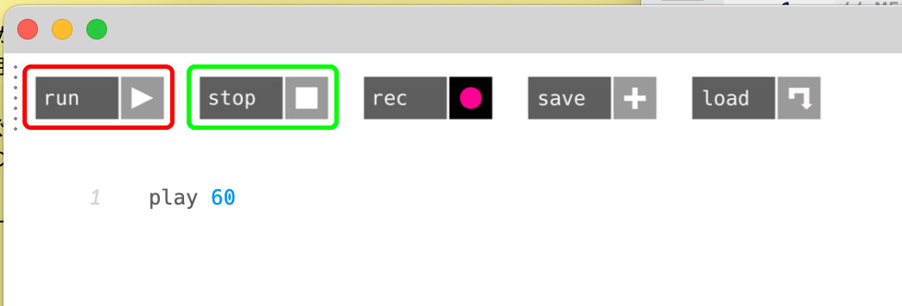
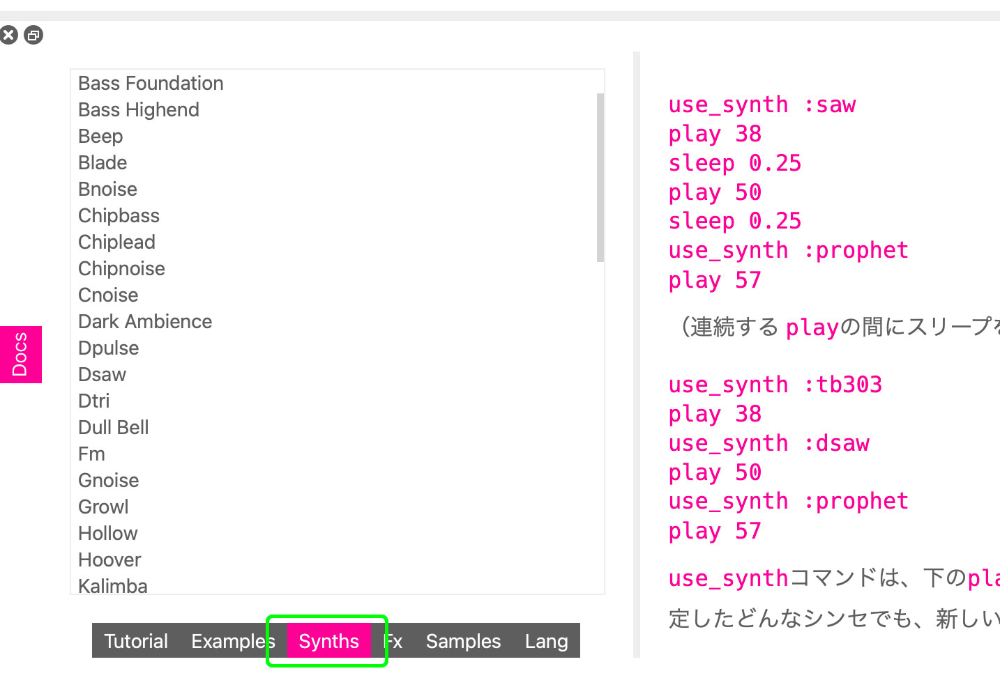
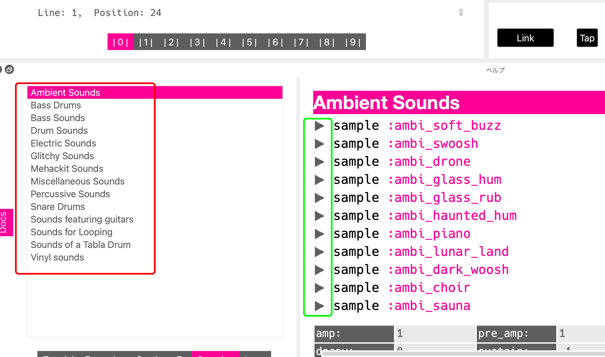
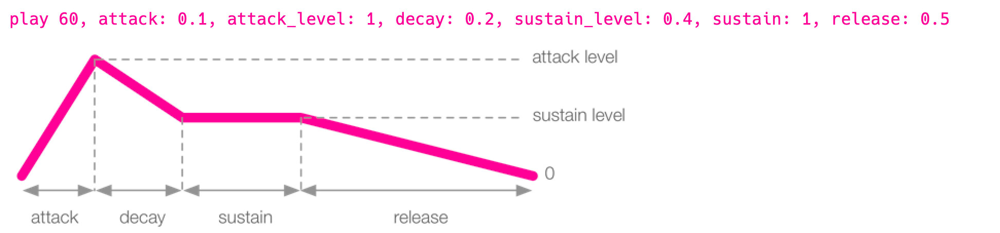

# CCBT_Camp_22023 team GAKKI

## Sonic Pi introduction
___
### How to play / stop  

press run to play ( ⌘ + r )  
press stop to stop ( ⌘ + s )  
___
### Make your synthesizer
#### Your first synthesizer in Sonic Pi
```
play 60
```

#### Change the type of sythesizer
```
use_synth :saw
play 60
sleep 1
use_synth :prophet
play 60
sleep 1
use_synth :tb303
play 60
sleep 1
use_synth :dsaw
play 60
sleep 1
use_synth :prophet
play 60
sleep 1
```

try synths in the below list on your own.


___
### Play sample
```
sample :ambi_lunar_land
```

### Try samples in Sonic Pi

Choose the type of samples from left and press the play buttons on the right.




___
### Create enverope
ADSR in Sonic Pi
