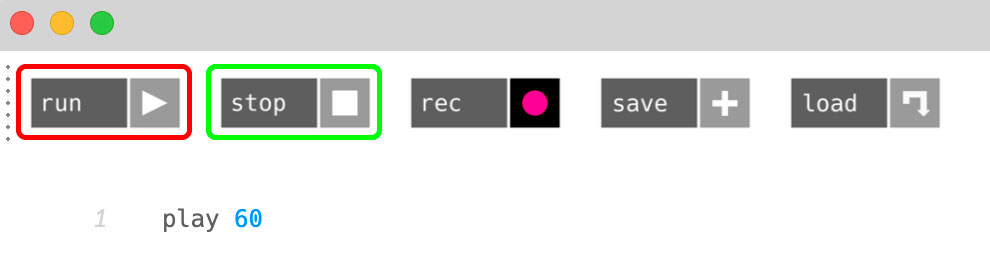
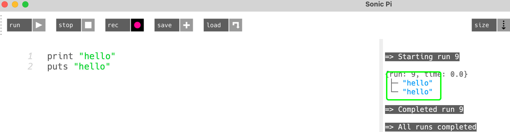

# CCBT_Camp_22023 team GAKKI

# Sonic Pi Introduction

<br/>

## How to play / stop  

<br/>
<br>
press run to play ( ⌘ + r )  
press stop to stop ( ⌘ + s )  

--

## print

```
print "hello"
puts "hello"
```

<br>

<br/>

## Make your synthesizer

<br/>

#### Your first synthesizer in Sonic Pi
```
##| comment
##| play C
play 60
##| wait 1 sec
sleep 1
##| This is also play C
play :C
```
<br/>

#### Change the type of sythesizer

```
use_synth :saw
play 60
sleep 1
use_synth :prophet
play 60
sleep 1
use_synth :tb303
play 60
sleep 1
use_synth :dsaw
play 60
sleep 1
use_synth :prophet
play 60
sleep 1
```
<br/>
Find your favorites from the list.


--
<br>

## Play sample
```
sample :ambi_lunar_land
```

### Try samples in Sonic Pi

Choose the type of samples from left and press the play buttons on the right.


--
<br>

## Create enverope
ADSR in Sonic Pi  
```
play 60, attack: 0.1, attack_level: 1, decay: 0.2, sustain_level: 0.4, sustain: 1, release: 0.5 
```


<br>

## Play in loop
```
live_loop :beat do
  ##| choose sample
  sample :loop_tabla
  
  ##| choose synth
  use_synth :prophet
  
  ##| play synth with volume and random cutoff filter
  play :e1, release: 8, cutoff: rrand(70, 130), amp: 0.1
  
  ##| sleep duration of sample
  sleep sample_duration :loop_tabla
end
```
## Receive OSC

### Trigger by OSC
```
live_loop :playp do
  use_real_time
  
  ##| make sure OSC prameter is in array
  key = (sync "/osc*/play_sound")[0]
  
  ##| play synth with amplifiy and release option
  play key, amp: 0.3, release: 2
  
  ##| play once in twice randomly
  play key+3, amp: 0.3, release: 2 if one_in(2)
  
  ##| play once in three times randomly
  play key+7, amp: 0.3, release: 2 if one_in(3)
  
  ##| play once in four times randomly
  play key+10, amp: 0.3, release: 2 if one_in(4)
end
```

### Set loop interval by OSC
Use Set / Get for thread safe
```
set :interval,1

live_loop :playp do
  use_real_time
  set :interval, (sync "/osc*/sensor")[0]
end


live_loop :getter do
  sample :elec_ping
  interval = get[:interval]
  if interval < 0.1
    interval = 0.1
  end
  sleep interval
end
```